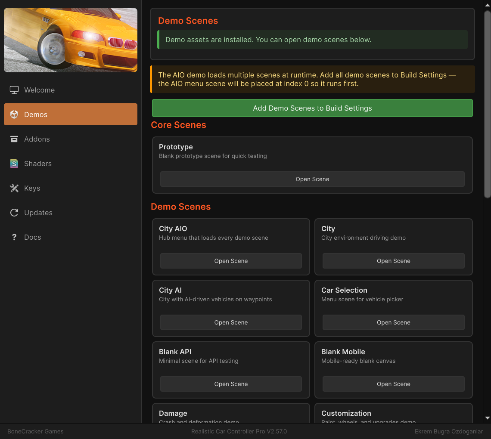

# Demo Content

RCCP includes a set of demo scenes, vehicles, environments, and interactive objects as a separate addon package. The demo content is **not** imported by default -- you need to install it manually. This keeps your project size small until you choose to explore or reference the demos.

This page covers how to install the demo content, what each scene demonstrates, and how to use the included scripts and environmental objects in your own projects.

---

## Installing Demo Content

There are two ways to install the demo content:

### Method 1: Welcome Window (Recommended)

1. Open the Welcome Window: **Tools > BoneCracker Games > Realistic Car Controller Pro > Welcome Window**.
2. Go to the **Demos** tab.
3. Click **Import Demo Content**.
4. Confirm the import dialog.



### Method 2: Manual Import

1. Navigate to `Assets/Realistic Car Controller Pro/Addons/Installers/` in your Project window.
2. Double-click `RCCP_DemoAssets.unitypackage`.
3. In the Import dialog, click **Import** to bring in all demo assets.

After import, demo content is installed to:

```
Assets/Realistic Car Controller Pro/Addons/Installed/Demo Content/
```

The scripting symbol `RCCP_DEMO` is set automatically after a successful import.

### Removing Demo Content

To remove demo content and reduce your build size, use the **Delete Demo Content From Project** button on the Demo Content card in the Welcome Window's **Addons** tab. This deletes the installed demo files, restores the demo vehicle and demo scene registries to their factory state, removes the demo scenes from Build Settings, and clears the `RCCP_DEMO` scripting symbol.

---

## Prototype Scene (Always Available)

RCCP always includes one simple test scene, regardless of whether demo content is installed:

| Scene | Location |
|-------|----------|
| RCCP_Scene_Blank_Prototype | `Assets/Realistic Car Controller Pro/Scenes/` |

This scene contains a flat ground plane with a single vehicle. Use it for quick testing, verifying your setup, or experimenting with RCCP components without needing the full demo package.

---

## Demo Scenes

After installing demo content, the following scenes become available in `Assets/Realistic Car Controller Pro/Addons/Installed/Demo Content/Scenes/`:

| Scene | What It Demonstrates |
|-------|----------------------|
| RCCP_Scene_Blank | Empty scene with one vehicle -- minimal starting point |
| RCCP_Scene_Blank_API | Spawning and registering vehicles via the [RCCP API](16_api_reference.md) |
| RCCP_Scene_Blank_Customization | The vehicle [customization](12_customization.md) UI and system |
| RCCP_Scene_Blank_OverrideInputs | Controlling vehicles with [external/custom inputs](06_overriding_inputs.md) |
| RCCP_Scene_Blank_Transport | Vehicle teleportation using the transport API |
| RCCP_Scene_CityNew | Full city environment for free driving |
| RCCP_Scene_CityNew_AI | City environment with [AI traffic vehicles](13_ai_vehicles.md) |
| RCCP_Scene_CityNew_AIO | All features combined -- city, AI, customization, vehicle selection |
| RCCP_Scene_CityNew_SelectVehicle | Vehicle selection and switching at runtime |
| RCCP_Scene_Damage | The [damage system](11_damage_system.md) in action |

### Build Settings Auto-Registration

After the demo content `.unitypackage` is imported, the Welcome Window installer flow registers the demo content assets with the project automatically. Demo Content and Photon scenes are also pre-registered in `EditorBuildSettings`, so they appear in **File > Build Settings** without manual addition.

---

## Demo Vehicles

Demo vehicle prefabs are referenced by the `RCCP_DemoVehicles` ScriptableObject located in:

```
Assets/Realistic Car Controller Pro/Resources/RCCP_DemoVehicles.asset
```

These prefabs are fully configured with all RCCP components (engine, gearbox, lights, damage, and so on). They serve as useful references when setting up your own vehicles. To inspect one, select a demo vehicle prefab and examine its components in the Inspector.

---

## Demo Scripts

The following scripts drive the demo scenes. They are located in `Assets/Realistic Car Controller Pro/Scripts/Demo/` and can be used as reference for your own implementations.

### Scene Management Scripts

| Script | Purpose |
|--------|---------|
| `RCCP_Demo` | Main demo UI controller. Manages vehicle spawning, vehicle selection, behavior switching, scene restart, and quit. Used in most demo scenes. |
| `RCCP_DemoAIO` | All-in-one demo controller for the AIO scene. Handles scene loading with a loading screen, addon button states (Photon, SharedAssets, Traffic), and persists across scene transitions via `DontDestroyOnLoad`. |

### Vehicle Interaction Scripts

| Script | Purpose |
|--------|---------|
| `RCCP_CarSelectionExample` | Example vehicle gallery / showroom. Spawns vehicles from the demo vehicles list and lets the player cycle through them. Good reference for building your own vehicle selection screen. |
| `RCCP_CharacterController` | Animates the driver character model. Feeds vehicle state (speed, steering, and so on) to the driver's Animator component. |
| `RCCP_Telemetry` | Displays a runtime UI overlay with vehicle telemetry data (speed, RPM, gear, and other values). Useful for debugging and testing. |

---

## Environmental Objects

RCCP includes several interactive objects you can place in your own scenes. All of them use trigger colliders and detect vehicles automatically. They are located in `Assets/Realistic Car Controller Pro/Scripts/Demo/`.

### Interactive Stations

| Object | Script | What It Does |
|--------|--------|-------------|
| Gas Station | `RCCP_GasStation` | Refuels the vehicle over time when it enters the trigger zone. Only works if the vehicle has a FuelTank component enabled. The `refillSpeed` field controls how fast the tank fills. |
| Repair Station | `RCCP_RepairStation` | Instantly repairs all vehicle damage when the vehicle enters the trigger zone. Requires the vehicle to have a Damage component. |
| Customization Station | `RCCP_CustomizationStation` | Opens the customization menu when the vehicle enters the trigger zone. Requires the vehicle to have a Customizer component. |

### Obstacles and Hazards

| Object | Script | What It Does |
|--------|--------|-------------|
| Spike Strip | `RCCP_SpikeStrip` | Deflates tires when a wheel collider enters the trigger zone. |
| Speed Limiter | `RCCP_SpeedLimiter` | Slows the vehicle by increasing its rigidbody drag while inside the trigger zone. |

### Transport

| Object | Script | What It Does |
|--------|--------|-------------|
| Teleporter | `RCCP_Teleporter` | Teleports the vehicle to a designated destination point when it enters the trigger zone. |

### Destruction Props

| Object | Script | What It Does |
|--------|--------|-------------|
| Crash Hammer | `RCCP_CrashHammer` | Animated hammer that swings and impacts vehicles. |
| Crash Press | `RCCP_CrashPress` | Animated press that crushes vehicles from above. |
| Crash Shredder | `RCCP_CrashShredder` | Animated shredder for vehicle destruction. |

### Pushable Props

| Object | Script | What It Does |
|--------|--------|-------------|
| Prop | `RCCP_Prop` | Generic interactive prop (cones, barriers, and so on) that can be pushed around by vehicles using physics. |

### Using Environmental Objects in Your Own Scenes

To add any of these objects to your scene:

1. Locate the prefab in the demo content Prefabs folder, or create a new GameObject.
2. Add the corresponding script component (for example, Add Component > BoneCracker Games > Realistic Car Controller Pro > Misc > RCCP Gas Station).
3. Ensure the GameObject has a **Collider** with **Is Trigger** enabled.
4. For the Teleporter, assign a destination Transform in the Inspector.
5. For the Gas Station, adjust the `refillSpeed` value as needed.

---

## Demo Content Structure

After installation, the demo content folder is organized as follows:

```
Addons/Installed/Demo Content/
    Animators & Animations/   -- Character and prop animations
    Documentation/            -- Demo-specific notes
    Editor/                   -- Editor scripts for demo initialization
    Materials/                -- Materials for demo environments and props
    Models/                   -- 3D models for city, props, and characters
    Prefabs/                  -- Ready-to-use prefabs for all demo objects
    Scenes/                   -- All demo scenes listed above
    Terrain/                  -- Terrain data for city environments
    Textures/                 -- Textures for demo assets
```

---

## Next Steps

- [Vehicle Setup](03_vehicle_setup.md) -- Create your own vehicle from scratch
- [Installation](01_installation.md) -- Install additional addon packages (Photon, Mirror, Traffic)
- [Customization](12_customization.md) -- Explore the vehicle customization system
- [API Reference](16_api_reference.md) -- Learn the public API used in the API demo scene
- [Render Pipelines](18_render_pipelines.md) -- Set up materials for URP or HDRP if demo scenes look wrong

---

**Support:** bonecrackergames@gmail.com | [www.bonecrackergames.com](https://www.bonecrackergames.com)

**Need help?** See [Troubleshooting](25_troubleshooting.md)
