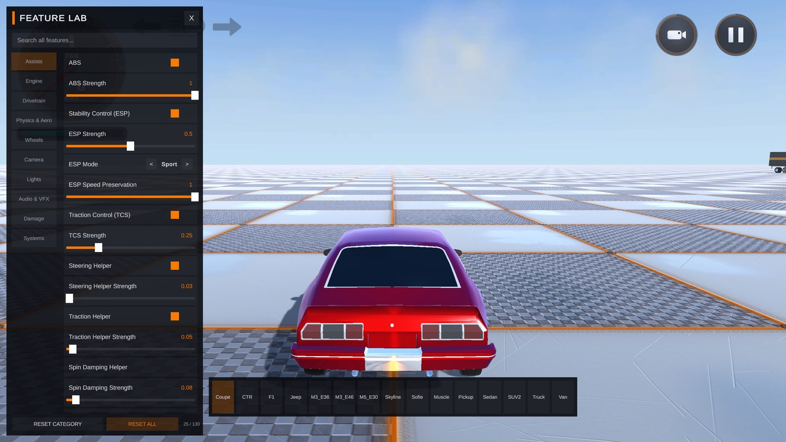

# Feature Lab

The Feature Lab is a single demo scene that exposes 130 of RCCP's live-tunable features through one self-assembling on-screen panel, on top of a purpose-built proving ground designed to actually exercise what you're tuning. Instead of reading a field name in the Inspector and guessing what it does, you flip it in the Feature Lab and drive straight into a zone built to show the effect immediately -- a drag strip for launch control, a skidpad for ESP, a bump lane for suspension, and so on.

It exists for one reason: RCCP has a very large tunable surface, and the fastest way to learn what a setting actually does is to change it and feel the difference in the same few seconds, on the same car, without leaving Play Mode.

---

## What Is the Feature Lab

**Scene:** `RCCP_Scene_FeatureLab` (installed with the [Demo Content](19_demo_content.md) addon, at `Addons/Installed/Demo Content/Scenes/`)

Open it the same way as any other demo scene -- **Tools > BoneCracker Games > Realistic Car Controller Pro > Welcome Window > Demos tab > Feature Lab**, or double-click the scene file directly once Demo Content is imported.

Press Play. A vehicle spawns automatically and the Feature Lab panel opens with it. From there:

- Press **F** (or tap the **FEATURES** button in the top-right corner) to show or hide the panel.
- Use the vehicle bar along the bottom of the screen to switch between all **15 demo vehicles** without leaving the scene -- the proving ground stays put, and the panel rebinds to whichever car you pick. Each vehicle spawns fresh, so per-vehicle tuning changes do **not** carry over between cars; only settings-level entries that apply globally (the Handling Preset, touch controls, and other Systems/Settings-clone features) persist across a switch.
- Everything you touch in the panel takes effect on the live vehicle in real time. There is no "Apply" button and nothing to save -- see [Notes](#notes) below for exactly what does and doesn't persist.



The 130 features are organized into 10 categories, matching the order they appear in the panel's sidebar:

| Category | Features | What it covers |
|---|---|---|
| Assists | 25 | ABS, ESP (mode, intensity, deadband, K_us, preserve speed), TCS, steering/traction/spin-damping helpers |
| Engine | 11 | Torque, RPM limits, rev limiter, launch control, two-step, fuel cut, engine addon dials |
| Drivetrain | 14 | Clutch, gearbox shift behavior, differential type, drive type, manual/automatic transmission |
| Physics & Aero | 15 | Downforce, drag, inertia tensor tuning, handling presets, wheel simulation quality, Lock Manual Tuning |
| Wheels | 9 | Suspension spring/damper/distance, tire grip, deflate/inflate |
| Camera | 17 | Camera mode, FOV, distance, orbit/follow tuning, collision shake, interior audio muffle |
| Lights | 7 | Headlights, indicators, brake light behavior, light breakage |
| Audio & VFX | 9 | Engine volume mix, exhaust flames, backfire RPM window, wheel blur |
| Damage | 7 | Deformation toggle, repair, fuel refill, damage multiplier |
| Systems | 16 | Photo Mode, recorder/replay, telemetry, trailer coupling, respawn, mobile controls, time scale, factory reset |

That's every category the panel shows, in the order the sidebar shows them, adding up to the full 130.

---

## The Panel

The panel is self-assembling -- it builds every row from the live RCCP catalog at runtime, so it always matches whatever vehicle is currently active. Nothing about its layout is hand-authored in the scene.

**Category rail.** The left-hand rail lists all 10 categories from the table above. Click one to filter the list to just that category, with a running count in the footer ("25 / 130", for example) so you always know how many features are visible versus how many exist in total.

**Search.** The search field above the rail filters across *every* category by name, id, and description, not just the currently selected one -- type "drift" and you'll see steering helper, ESP mode, and the drift-relevant differential settings together, regardless of which category they live in. Clearing the search returns you to your last selected category.

**Rows and expandable cards.** Each feature is a single row: its name, and an inline control appropriate to its type -- a toggle switch, a slider with a live value readout, a `< Preset >` cycler for enum-style options, a run button for one-shot actions (like "Repair Vehicle" or "Clean Skidmarks"), or a plain readout for values you can observe but not set directly (like current gear or fuel level).

Click a row's name to expand its card. The card holds:
- A plain-English description of what the feature actually does -- written for someone who has never opened the RCCP source, not a restatement of the field name.
- A **BEST TRIED WITH** hint on features that show best on a particular vehicle or in a particular proving-ground zone (drift helpers point you at the skidpad, launch control points you at the drag strip, and so on).
- A per-feature **RESET** button that restores that one value to what it was when the vehicle spawned.

**Live readouts.** Every visible row refreshes its value on a **10 Hz** tick (ten times per second, on unscaled time) while the panel is open, so readouts like current gear, wheel slip, or ESP engagement state track the live vehicle without you needing to reopen anything. This tick pauses automatically while Photo Mode is active (see [Notes](#notes)).

**Capability-gated rows.** Not every feature applies to every vehicle -- an open-wheel car has no exhaust to flame, a car with no Fuel Tank add-on has nothing to refill, and inertia tensor sliders only matter once you've turned on inertia tensor override. Rather than hiding these rows outright, the Feature Lab greys out their controls and shows the real reason in the card, in place of the description -- for example, *"Requires the Recorder addon under OtherAddons"* or *"Only has a visible effect while touch controls are enabled."* You always know why something is unavailable, not just that it is.

**Three levels of reset.** Undoing a change doesn't require remembering what you touched:
- **RESET** on a single card -- restores that one feature.
- **RESET CATEGORY** in the footer -- restores every feature in the currently selected category.
- **RESET ALL** in the footer -- restores every feature the panel has captured a default for, across all 10 categories.

All three restore to the snapshot captured right after the vehicle finished spawning and its behavior preset settled -- not to RCCP's factory defaults, but to "how this car actually started."

---

## The Proving Ground

The scene isn't just a flat pad with a car on it -- each zone was built to put a specific slice of the panel to the test. Drive to a zone, open the matching category, and change the relevant sliders to feel the difference immediately.

| Zone | Try these panel features |
|---|---|
| **Drag strip** | Launch control and the two-step rev limiter (Engine), cruise control and the speed limiter (Assists), downforce (Physics & Aero) |
| **Hill (3 grades)** | Hill-start assist (Assists) -- three increasing pitches so you can find where it stops helping without it |
| **Skidpad + slalom** | ESP mode/intensity/deadband, TCS, steering and traction helpers (Assists), inertia tensor tuning (Physics & Aero) |
| **Grass and sand strips** | Ground materials and skidmark behavior -- feel the grip and see the skidmark/particle differences between surfaces |
| **Bump lane** | Suspension spring, damper, and distance (Wheels) |
| **Tunnel** | Headlights, indicators, and light breakage (Lights) |
| **Gas station** | Fuel tank refill (Damage, when the vehicle carries a Fuel Tank add-on) |
| **Repair station** | Damage repair (Damage) |
| **Customization station** | Opens the standard RCCP customization menu, independent of the panel |
| **Spike strip** | Tire deflate/inflate (Wheels) and damage response |
| **Trailer parking** | Trailer coupling (Systems) -- reverse the truck into the trailer to couple it (the coupler triggers on contact, not on a button), then use **Detach Trailer** in the Systems category to release it |

None of the zones require the panel to be open to work -- they're ordinary RCCP-driven trigger objects (gas station, repair station, spike strip, and so on) exactly like the ones documented in [Demo Content](19_demo_content.md#environmental-objects). The panel just gives you the dial to turn before you drive through them.

---

## Drop the Panel Into Your Own Scene

You don't need the Feature Lab scene to use the panel -- it ships as a single drop-in prefab:

```
Assets/Realistic Car Controller Pro/Prefabs/UI/RCCP_FeatureLabCanvas.prefab
```

To add it to any scene of your own:

1. Drag `RCCP_FeatureLabCanvas` into the Hierarchy. That's the entire setup step -- there is nothing to wire up, no references to assign, and no other components to add.
2. Make sure the scene has a working RCCP vehicle (an `RCCP_SceneManager` with an active player vehicle registered -- the same requirement any RCCP scene already has).
3. Press Play. The panel builds its full 130-row catalog at `Start()`, binds to whichever vehicle is currently active, and responds to **F** / the **FEATURES** button immediately.

The prefab is a bare `Canvas` (Screen Space - Overlay, sorting order 50, `CanvasScaler` set to Scale With Screen Size at a 1920x1080 reference) carrying exactly two components -- the Feature Lab manager and the panel UI. It builds its own `EventSystem` if the scene doesn't already have one, so it works even in a scene with no UI at all. Because its sorting order (50) sits above the standard `RCCP_Canvas` HUD (order 0), it's safe to drop into a scene that already has the normal player HUD -- the Feature Lab panel simply renders on top.

This is the same prefab the Feature Lab demo scene itself uses -- nothing about the demo scene's copy is special or pre-configured differently from the one you'd drag in yourself.

---

## Notes

- **Behavior presets overwrite manual tuning -- by design.** The **Handling Preset** feature (Physics & Aero) applies a full RCCP behavior preset to *every* vehicle in the scene, not just the active one, exactly like [RCCP.SetBehavior()](16_api_reference.md) does everywhere else. If you've hand-tuned a car's sliders and then pick a different preset (or the scene re-applies the current one), your manual changes get baked over. Turn on **Lock Manual Tuning** (also in Physics & Aero) on the vehicle you're hand-tuning *before* you start -- it's the vehicle-level opt-out that keeps preset re-applies from touching that specific car.
- **Nothing the panel changes ever persists.** Every setting the Feature Lab writes goes to RCCP's runtime settings clone or directly to the live components on the spawned vehicle -- never to your project's `.asset` files. This is the same runtime-clone contract used everywhere in RCCP (see [Settings](04_settings.md)); exiting Play Mode discards everything you changed, every time, with no exceptions.
- **Photo Mode owns the screen.** Entering [Photo Mode](16_api_reference.md) automatically hides the Feature Lab panel and the FEATURES button and pauses the panel's 10 Hz refresh tick, so it never fights Photo Mode for screen space or input. It reappears the instant you exit Photo Mode.
- **The time-scale slider restores itself.** The Systems category's Time Scale slider is one of the few places allowed to write `Time.timeScale` directly. If you leave the scene (or remove the Feature Lab canvas) while the slider is set below 1, time scale is reset back to normal automatically -- you can't accidentally walk away with the game left in slow motion.
- **The Tab shortcut is an input action, not a hardcoded key.** The keyboard shortcut is the **Feature Lab** action in the **Optional** map of `RCCP_InputActions.inputactions` -- the same Input System asset every other RCCP key lives in. To rebind it, edit that action's binding (default `<Keyboard>/tab`); the panel listens through `RCCP_InputManager.OnFeatureLab`, so no code changes are needed. Like all RCCP keyboard events, it is suppressed while a UI input field (such as the panel's search box) has focus.

---

## Next Steps

- [Demo Content](19_demo_content.md) -- installing the addon that ships this scene, and the other demo scenes and environmental objects available alongside it
- [Settings](04_settings.md) -- the runtime-clone contract the Feature Lab's writes follow, and where behavior presets actually live
- [API Reference](16_api_reference.md) -- the public `RCCP` methods behind many of the panel's actions (Photo Mode, transport, behavior switching, and so on)
- [Telemetry and Debug](17_telemetry_debug.md) -- a lighter-weight, always-on alternative when you just need to watch values, not change them

---

**Support:** bonecrackergames@gmail.com | [www.bonecrackergames.com](https://www.bonecrackergames.com)

**Need help?** See [Troubleshooting](25_troubleshooting.md)
